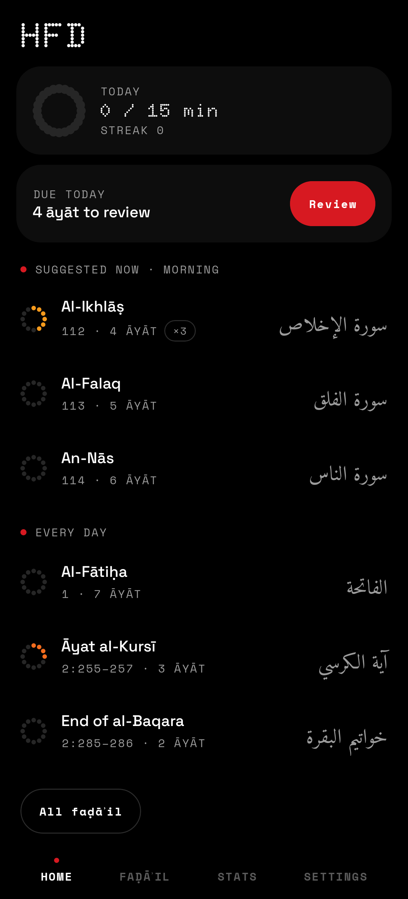
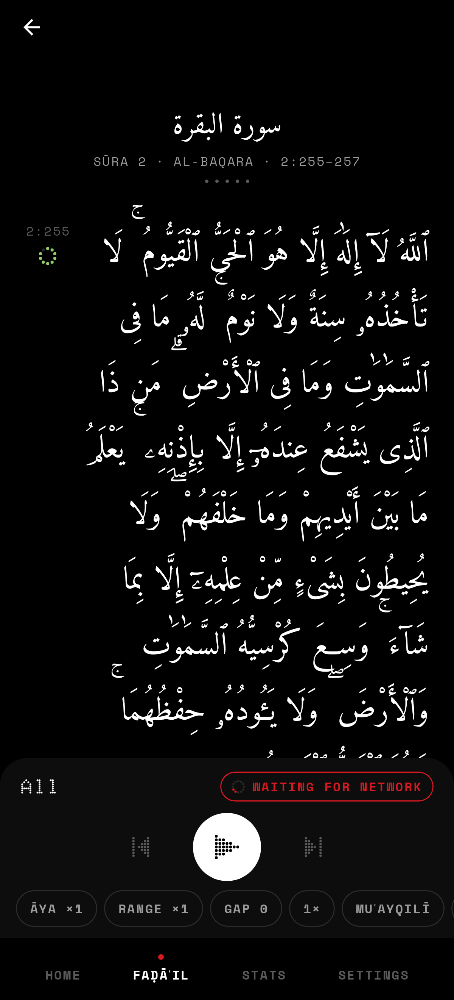
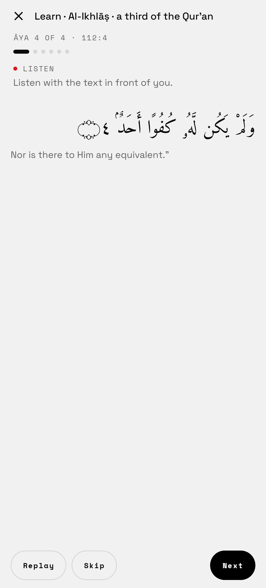
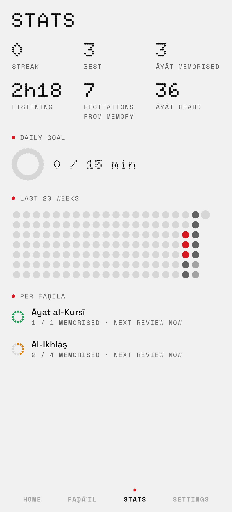

# HFD

A personal, sideloaded Android app for learning by ear the Qur'an verses and sūras that have
established virtues (faḍāʾil): listen, repeat, test yourself and track progress per āya.
Offline-first, no accounts, no analytics, no ads. English and French UI.

Styled like Nothing OS (black and white, one red accent, dot-matrix type), with the Qur'an text
given room and calm.

<p>




</p>

(All screens, light and dark, in [docs/screenshots](docs/screenshots); rendered by CI with
Robolectric.)

## Install

**https://github.com/kream0/hfd/releases/latest/download/hfd.apk**

Open that link on the phone, allow "install unknown apps" for the browser, then install. After
that the app updates itself from new releases. Android 8.0 or newer.

## Features

- **What to learn: the passages of the reference app** *سور وآيات فاضلة* (as listed with the
  app's own recitation and by its publisher on aljamaa.net), in its order: al-Fātiḥa; al-Baqara
  1–5, Āyat al-Kursī to "khālidūn" (255–257), 285–286; Āl ʿImrān 1–9, 18–19, 26–27, 190–200; the end of at-Tawba ×7;
  the end of al-Kahf, and al-Kahf in full (Friday); as-Sajda, Yā-Sīn, Ghāfir 1–3, ad-Dukhān,
  the end of al-Fatḥ, al-Wāqiʿa, the musabbiḥāt (al-Ḥadīd, al-Ḥashr, aṣ-Ṣaff, al-Jumuʿa,
  at-Taghābun), al-Mulk, al-Aʿlā, aḍ-Ḍuḥā, ash-Sharḥ, al-ʿAlaq, al-Qadr, az-Zalzala ×4,
  at-Takāthur, al-ʿAṣr ×2, Quraysh, al-Māʿūn, al-Kawthar ×3, al-Kāfirūn ×4, an-Naṣr ×4,
  al-Ikhlāṣ ×3, al-Falaq, an-Nās, and the closing (al-Fātiḥa and al-Baqara 1–5). A `:core`
  test pins this list. The reference's recitation counts (×7…) are kept in the data only: the
  app is for learning the passages, not for reciting the daily wird.
- **Narrations, verified:** each passage lists the ḥadīth about it, with a short faithful
  paraphrase (French / English), its sources (sunnah.com / dorar.net links) and its grading with
  the grader. Ṣaḥīḥ and ḥasan show by default; weak (ḍaʿīf) and fabricated (mawḍūʿ) ones only
  with *Settings → Reading → Show weak narrations*, clearly labelled. Where no narration about a
  passage is known, the app says so rather than invent one.
- **Learning path:** Home puts learning first: today's goal and the reviews due, then
  *Continue learning* (the passages begun, straight into Learn at the next new āya) and *Next
  to learn* (the passages not begun, shortest first: al-Kawthar, al-ʿAṣr, al-Ikhlāṣ…). A
  passage made only of shorter ones (the closing) is learnt through them.
- **Reading view:** Tanzil's Uthmani text, verbatim, in Amiri Quran, right-to-left, large, with
  ḥarakāt, waqf marks and āya numbers in Arabic-Indic digits between ornate brackets ﴿٤﴾. Each sūra's basmala
  is shown above its first āya. Optional translation of meanings under each āya (Hamidullah in
  French, Saheeh International in English; *Auto* follows the app language). Text size S–XL.
- **Per-āya player:** playback is built as an explicit plan, a flat list of items such as
  basmala, āya (repetition 1), gap, āya (repetition 2), gap, …, next āya. Settings: repeat each
  āya ×1/3/5/7/10/∞, repeat the range ×1/2/3/5/10/∞, a pause after each recitation of ½×, 1× or
  1½× the āya's length (to repeat it aloud), speed 0.75–1.25×, reciter, basmala before a sūra,
  and a sub-range of the faḍīla (range chip, or long-press an āya). Changing a setting rebuilds
  the plan from the current āya. Gaps are `hfd://silence/<ms>` items (a WAV of silence made on
  the fly) sized from the āya's measured length.
- **Reciters** (everyayah.com, one MP3 per āya): Mishary Alafasy (`Alafasy_128kbps`),
  al-Ḥuṣarī (`Husary_128kbps`), al-Ḥuṣarī Muʿallim (`Husary_Muallim_128kbps`), al-Minshāwī
  murattal (`Minshawy_Murattal_128kbps`), ʿAbd al-Bāsiṭ murattal (`Abdul_Basit_Murattal_192kbps`).
  Folder names were checked on the server by the *Data* workflow.
- **Media session:** notification, lock screen and Bluetooth earbuds. Next / previous jump to the
  next / previous āya (a `ForwardingPlayer`), not the next repetition; the title reads like
  "Āyat al-Kursī · 2:255 · 3/5". Play on the earbuds with the app closed resumes exactly where
  you left off.
- **Reading along:** the playing āya is highlighted and scrolled into view (unless you just
  scrolled yourself); tap an āya to play from it; long-press to repeat it or start / end the
  range there. Sleep timer: end of this faḍīla, or 15 / 30 / 60 minutes.
- **Offline:** opening a faḍīla downloads all its āya files (resumable, retried when the network
  returns); local files always play first and streamed ones are cached (256 MB). The chip goes
  red → orange → yellow → green as files arrive. *Settings → Listening* shows and clears them.
- **Progress per āya:** every āya is a card keyed `sūra:āya` holding listening stats
  (recitations heard to ≥ 90 %, listening time, last heard) and its memorisation state under
  **FSRS-6** (state, due, stability, difficulty, reps, lapses, last rating), ported to pure
  Kotlin and checked against the reference py-fsrs 6.3.2. Its strength (current
  retrievability) shows as a red → green ring next to the āya.
- **Learn:** per āya, listen ×N with the text, repeat aloud in the pauses, first word only,
  recite from memory, reveal and rate Again / Hard / Good / Easy (each button shows the next
  interval); after each new āya, recite from the start of the range (sabaq / sabqī).
  Long-press an āya to learn from there, test it, or mark it as known.
- **Review:** everything due today across all faḍāʾil, in muṣḥaf order: text hidden, recite,
  reveal (the āya plays), rate. A full test of a faḍīla is suggested once all its āyāt are
  memorised, then every 30 days.
- **Recite** (Tarteel-style, on every passage): recite from memory into the microphone and the
  app follows along, revealing each word once said, marking skipped (struck through) and wrong
  words, with *Hint* for the next word (counted as a mistake). Speech is cut at the pauses and
  recognised **on the phone** by [whisper.cpp](https://github.com/ggml-org/whisper.cpp) with
  Tarteel's Qur'an model [`whisper-tiny-ar-quran`](https://huggingface.co/tarteel-ai/whisper-tiny-ar-quran)
  (Apache-2.0; 43 MB, downloaded once from this repo's `speech-model` release and checked by
  SHA-256). What was heard is aligned letter by letter with the text (`:core` `Tracker`,
  without ḥarakāt or alif forms, so spelling variants of the Uthmani script don't count as
  mistakes). Each finished āya is a review in the log with its mistakes (none → Good, a few →
  Hard, more → Again), so it drives FSRS; Stats shows recitations and accuracy, and the
  progress keeps each āya's weak words. No audio is stored or sent. 64-bit ARM phones only.
- **Home and Stats:** today's goal (minutes of practice), streak, due reviews, continue where
  you left off, per-faḍīla progress (memorised / total, next review), a dot-matrix calendar,
  total āyāt memorised and listening time.
- **Never lose progress:** every event (listen, rating, recitation from the start, test) is
  appended to `progress/events.jsonl`, from which all state and stats are rebuilt (a snapshot
  only speeds up startup). `progress/` and the settings are in Android Auto Backup; *Settings →
  Progress → Backup* exports / imports a JSON file (imports merge, nothing is overwritten).
  The app reopens exactly where you left it: tab, faḍīla, Learn step or test position, and the
  player's āya, repetition and position.
- **Reminders** (optional, *Settings → Reminders*): Āyat al-Kursī 15 minutes after each
  prayer (prayer times computed on the phone from a coarse location you set once, with the
  MWL, UOIF, ISNA, Egyptian, Umm al-Qurā or Karachi method; checked against adhan-js), as-Sajda
  and al-Mulk before sleep, al-Kahf on Friday, and āyāt due for review. Each opens the faḍīla,
  or plays it with *Listen*. Scheduled with WorkManager, so a reminder can arrive a few minutes
  late while the phone sleeps.
- **Updates:** on every start the app checks the repo's latest published release. A newer APK
  is downloaded in the background, its SHA-256 checked against the release's `version.json`,
  then the app offers *Install* (Android shows its own confirmation; the first time it asks to
  allow HFD to install apps). *Settings → Updates* has the version, *Check* and an
  auto-download switch. Pre-releases and test builds are never offered.
- **Never lose progress:** settings and progress are included in Android's Auto Backup.

Later: word-by-word highlighting (Quran.com / QUL timings), the Glyph Matrix on the back of
the phone (āya number and repetition).

## Releasing

Each of these builds the APK and attaches `hfd.apk` + `version.json` to the release:

- **Bump `VERSION`** (e.g. `0.2.0`), add a `## 0.2.0` section to `CHANGELOG.md` (used as the
  release notes) and push. If `v0.2.0` isn't released yet, CI tags that commit and publishes it.
- **Tag:** `git tag v0.2.0 && git push origin v0.2.0`.
- **Actions tab:** run *Build APK* by hand with a version.

Tags must look like `vMAJOR.MINOR.PATCH`; versionCode = major·1,000,000 + minor·1,000 + patch
(`v1.2.3` → `1002003`). Branch pushes run the unit tests and build a test APK (`0.dev.<run>`,
downloadable from the run's artifacts); any release updates it.

## Signing

Without configuration, CI signs with the **public dev key** in `keystore/hfd-dev.jks` (so
updates install over each other, but anyone could sign with it). To use a private key, add
these repository secrets:

```
keytool -genkeypair -keystore hfd.jks -alias hfd -keyalg RSA -keysize 2048 -validity 36500
base64 -w0 hfd.jks   # → KEYSTORE_BASE64
```

`KEYSTORE_BASE64`, `KEYSTORE_PASSWORD`, `KEY_ALIAS`, `KEY_PASSWORD`. Android refuses updates
across signing keys, so uninstall the dev-key build once when switching.

## Build locally

JDK 17 and the Android SDK (compileSdk 36):

```
./gradlew :core:test :app:assembleRelease   # → app/build/outputs/apk/release/app-release.apk
```

`:core` is plain Kotlin (Qur'an data, faḍāʾil dataset, playback plan, FSRS, progress, recitation
tracking) and its tests run on any JVM. The app builds whisper.cpp with the NDK (CMake 3.22.1).

## Data sources and licences

- **Qur'an text:** [Tanzil Project](https://tanzil.net), Uthmani text v1.1 (with pause marks,
  sajda and rub-el-ḥizb signs), CC BY 3.0, bundled verbatim with its copyright block
  (`app/src/main/assets/quran/quran-uthmani.txt`). The app parses it once into a compact JSON
  cache that carries the same notice. Changing the text is not allowed and the app never does:
  the only processing is setting each sūra's basmala apart from āya 1, the way Tanzil's own XML
  stores it (a unit test rebuilds every original line from the parsed text).
- **Sūra metadata:** Tanzil's `quran-data.xml` → `quran/suras.json`.
- **Translations of meanings:** Muhammad Hamidullah (French) and Saheeh International
  (English), from tanzil.net, bundled as published there.
- **Faḍāʾil dataset:** `app/src/main/assets/fadail.json` (schema 2: the passages, each with its
  narrations). Every reference was checked against the source text: the sunnah.com pages (fetched by the *Data* workflow's `verify` job,
  which prints each cited page), the hadith collections of
  [fawazahmed0/hadith-api](https://github.com/fawazahmed0/hadith-api), and al-Albānī's gradings
  on dorar.net. Nothing is cited that couldn't be checked; e.g. the Āyat al-Kursī-after-prayer
  entry names an-Nasāʾī's *as-Sunan al-Kubrā* without a number for that reason. `:core` tests
  validate every range against the sūra āya counts and require a source per entry; unverified
  entries (`verified: false`) are never shown.
- **Data refresh:** `tools/fetch-data.sh`, run by `.github/workflows/data.yml`, downloads the
  Tanzil files (checksums in `tools/data.lock`).
- **Fonts:** Amiri Quran, Doto, Space Grotesk, Space Mono — SIL Open Font License (`licenses/`).
- **Playback:** AndroidX Media3 (Apache 2.0).
- **Speech recognition:** whisper.cpp v1.7.6 (MIT), built from source by CMake; Tarteel AI's
  `whisper-tiny-ar-quran` (Apache-2.0), converted to whisper.cpp's format (8-bit) by
  `.github/workflows/model.yml`, which also measures it on EveryAyah recitations (about 13 %
  word error, greedy decoding).
